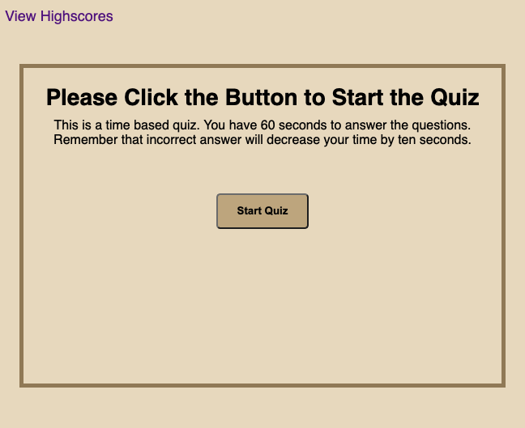
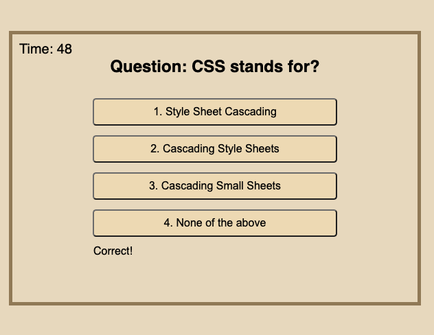
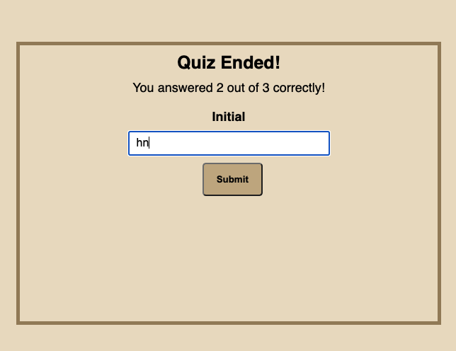
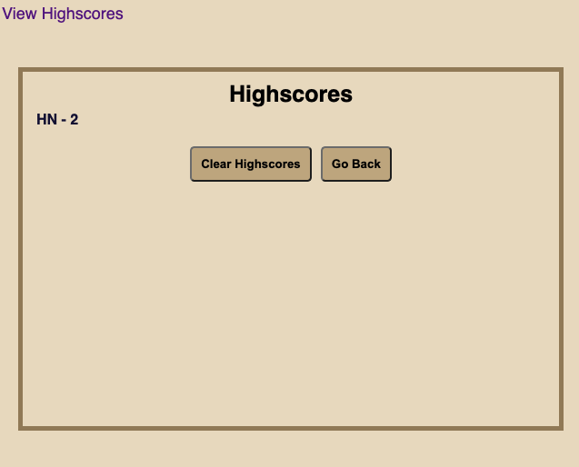

# code-quiz

# About
This is a timed based coding quiz application. By clicking the start quiz button, the question and timer appear. The users have one minute to complete the quiz. By answering a question, the next question appears. Every incorrect answer will decrease ten seconds from the timer. After completing all the questions, the users can see their score, and they can enter their initial in order to save the high score.

# Screenshots of the deployed application

# Links

[Link to the Deployed Webpage](https://hekmatsalehi.github.io/code-quiz/)
